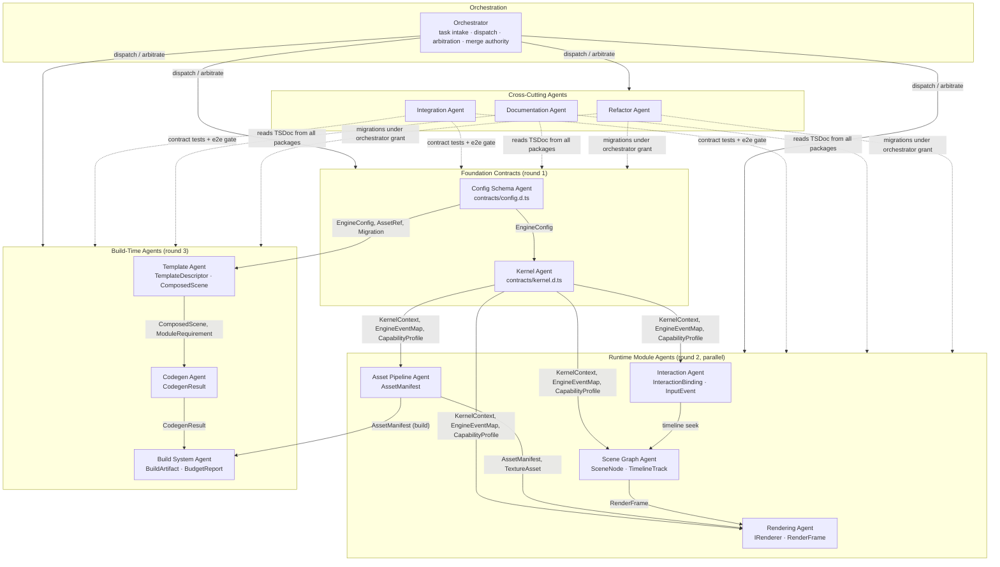

# Lumen Swarm — Multi-Agent Specification

**Companion to:** *Lumen Engine — Foundational Web Engine Architecture v1.0*
**Version:** 1.0 (Normative) · **Audience:** Orchestrator runtime, agent implementers, platform engineering

This document defines the twelve-agent swarm that builds and maintains the Lumen engine. It is written to be executed: an orchestrator following this spec can dispatch tasks, arbitrate conflicts, and gate integration without further interpretation.

---

## 1. Overview

### Swarm Philosophy

The swarm operates on three non-negotiable principles:

1. **Ownership-based isolation.** Every file in the repository has exactly one owning agent. No two agents ever write the same file. An agent that needs a change in another agent's files opens a change request (PR-style patch proposal) against that owner; it never edits the files directly. This eliminates merge conflicts by construction: the only conflicts that can exist are *contract* disagreements, which are handled by the framework in Section 5.

2. **Contract-first collaboration.** The only shared surface between agents is the typed interface layer in `contracts/`. Agents never depend on each other's implementations, internal helpers, or file layouts. A module agent consumes another module exclusively through its published contract slice (e.g., `contracts/kernel.d.ts`). If a capability is not in a contract, it does not exist as far as other agents are concerned.

3. **Orchestrator-mediated conflict resolution.** Agents do not negotiate bilaterally to a stalemate. Disagreements escalate through a fixed ladder ending in orchestrator arbitration, with interface-compatibility tests — not seniority, not argument volume — as the tiebreaker. The orchestrator owns the dependency graph, the dispatch schedule, and the final merge authority.

The twelve agents map 1:1 onto the nine engine modules defined in the architecture document (§3.1–3.9), plus three cross-cutting agents (Refactor, Documentation, Integration).

### Agent Topology



Dependency layers, top to bottom: (0) Orchestrator; (1) contract publishers — Config Schema and Kernel; (2) runtime module agents consuming Kernel contracts; (3) build-time agents consuming Config Schema and module contracts; (4) cross-cutting agents spanning everything. No edge ever points upward; a needed upward dependency is, by definition, a missing contract and must be created via CCP (Section 5).

---

## 2. Shared Conventions

These rules bind every agent. They are enforced by CI and by the orchestrator's pre-merge checks, not by convention alone.

### 2.1 Repository Layout (Monorepo)

```
lumen/
├── contracts/                    # THE shared surface. Cross-module types live ONLY here.
│   ├── kernel.d.ts               # LifecyclePhase, KernelContext, KernelHandle, EngineEventMap, CapabilityProfile, LumenPlugin, EngineError
│   ├── rendering.d.ts            # IRenderer, RenderFrame, RenderTargetDesc, QualityLevel, FrameStats, RendererBackend
│   ├── scene-graph.d.ts          # SceneNode, Transform3D, PropertyBinding, TimelineTrack, Keyframe, EasingName, CubicBezier
│   ├── asset-pipeline.d.ts       # AssetManifest, AssetEntry union, preload priorities
│   ├── interaction.d.ts          # NormalizedInputEvent, InteractionBinding, VirtualScroller, InputSource
│   ├── templates.d.ts            # TemplateDescriptor, SlotDefinition, ThemeTokens, ModuleRequirement, ComposedScene, TemplateKind
│   ├── codegen.d.ts              # CodegenTarget, CodegenResult, GeneratedModule, HydrationManifest
│   ├── config.d.ts               # EngineConfig, SceneConfig, AssetRef, Migration
│   ├── build.d.ts                # BuildArtifact, ArtifactFile, BudgetReport
│   └── package.json              # workspace package "@lumen/contracts", semver-versioned
├── packages/
│   ├── kernel/                   # lifecycle, event bus, scheduler, plugin registry, capability detection
│   ├── rendering/                # IRenderer backends: dom, canvas2d, webgl2 (Three.js), webgpu
│   ├── scene-graph/              # SceneNode hierarchy, dirty flags, timeline attach, serialization
│   ├── asset-pipeline/           # build transcode + runtime preloader/cache (HLS, KTX2, AVIF)
│   ├── interaction/              # input normalization, gestures, virtual scroller, a11y fallbacks
│   ├── templates/                # one TemplateDescriptor module per TemplateKind
│   ├── codegen/                  # ts-morph AST emit, hydration manifest, per-target entries
│   ├── config-schema/            # Zod schemas, JSON Schema emit, migration registry
│   └── build/                    # Vite programmatic orchestration, budgets, artifacts
├── assets/fixtures/              # test media; owned by Asset Pipeline Agent
├── docs/                         # owned by Documentation Agent
├── examples/                     # example apps per TemplateKind; owned by Integration Agent
├── tests/
│   ├── unit/<package>/           # colocated by owner agent
│   ├── contract/                 # interface-compatibility tests; owned by Integration Agent
│   └── e2e/                      # cross-package flows; owned by Integration Agent
├── .github/ or .ci/              # CI templates; owned by Build System Agent
└── package.json / pnpm-workspace.yaml / turbo.json
```

### 2.2 The `contracts/` Rule

- All cross-module types (everything named in the architecture document's data structures: `EngineConfig`, `SceneNode`, `AssetManifest`, `TimelineTrack`, `InteractionBinding`, `TemplateDescriptor`, `CodegenResult`, `BuildArtifact`, `KernelContext`, `IRenderer`, and their constituent types) live **only** in `contracts/`. Packages import them as `@lumen/contracts`; they never re-declare or re-export them.
- Each `contracts/*.d.ts` file has exactly one owning agent (Section 3). Other agents get read access and may propose changes via PR only.
- Changing any contract requires a **Contract Change Proposal (CCP)**: a written proposal naming the change, motivation, backward-compatibility assessment, and affected consumers. The CCP requires orchestrator approval plus sign-off from **every** agent whose package imports the changed symbol. Process in Section 5.2.
- Contract packages are semver-versioned. Breaking changes bump minor/major per Section 5.3.

### 2.3 Branch and Commit Conventions

- One branch per agent per task: `agent/<slug>/<task-id>-<short-desc>`, e.g. `agent/kernel/T-118-scheduler-posttask-polyfill`. Agents never commit to `main` directly.
- Commits: conventional-commit format scoped to the owning package, e.g. `feat(rendering): add WebGPU swapchain reconfigure on context loss`.
- A branch touches **only** files the agent owns. The orchestrator rejects any PR whose diff crosses ownership boundaries; cross-boundary work is split into a per-owner task chain.

### 2.4 Definition of Done

A task is complete only when all of the following hold:

1. **Types compile** — `tsc --noEmit` clean for the owned package and for `@lumen/contracts` if touched.
2. **Unit tests pass** — package coverage threshold met (≥ 85% lines for kernel/scene-graph, ≥ 75% elsewhere).
3. **Contract tests pass** — `tests/contract/` green for every contract slice the package produces or consumes.
4. **Docs updated** — TSDoc on every exported symbol; a docs PR handed to the Documentation Agent if public behavior changed.
5. **Budgets hold** — for runtime packages, the size/performance budgets from the architecture doc (§4) are verified by the build in CI.

---

## 3. Agent Specifications

Each agent section has exactly four subsections. Ownership globs are exclusive; where a file is listed under one owner, all other agents have read/PR-only access to it. Package ownership globs (`packages/<pkg>/**`) exclude `README.md` files, which are owned by the Documentation Agent (§3.11).

### 3.1 Kernel Agent

**Responsibilities.** Owns the `packages/kernel/` module: the lifecycle state machine (`created → booting → loading → ready → active → paused → disposed`), the typed pub/sub event bus, the plugin registry with capability-token DAG resolution, the cooperative frame scheduler (`scheduler.postTask()` with rAF/MessageChannel polyfill), boot-time capability detection producing the immutable `CapabilityProfile`, and module error boundaries. Guarantees the cross-cutting event-flow contract: all runtime cross-module communication flows through the bus; runtime modules never import each other.

**Files It Owns.** `packages/kernel/**`; `contracts/kernel.d.ts`; `tests/unit/kernel/**`. Read/PR-only: everything else, notably `contracts/rendering.d.ts` (consumes `FrameStats` reporting expectations). No other agent writes into `packages/kernel/`.

**Collaboration.** *Upstream:* consumes `EngineConfig` from Config Schema Agent (boot input) — contract dependency only. *Downstream:* every runtime agent (Rendering, Scene Graph, Asset Pipeline, Interaction) consumes `contracts/kernel.d.ts` — `KernelContext`, `EngineEventMap`, `CapabilityProfile`, `LumenPlugin`. Handshake protocol: the Kernel Agent publishes and freezes `contracts/kernel.d.ts` in round 1 of every release cycle; runtime agents may not begin implementation work against an unfrozen kernel contract. Sync point: contract freeze review with all four runtime agents before each implementation sprint; event-name additions (new namespaced events in `EngineEventMap`) require a CCP even when purely additive, because payload shape is a stability boundary.

**Conflict Resolution.** Follows the global ladder (Section 5). Specifics: (1) contract negotiation with the requesting agent via CCP — e.g., Rendering Agent requests a `scheduler:phase-timing` event; (2) orchestrator arbitration where the interface-compatibility test suite (`tests/contract/kernel/`) is the tiebreaker — a proposed event that breaks existing consumers fails arbitration automatically; (3) merge conflicts on `contracts/kernel.d.ts`: Kernel Agent's branch wins, the requester rebases; (4) deadlocks (e.g., two agents each demanding mutually exclusive event semantics) are broken by orchestrator task takeover: the orchestrator assigns the contract edit to the Kernel Agent directly with a written decision record.

### 3.2 Rendering Agent

**Responsibilities.** Owns `packages/rendering/`: the four `IRenderer` backends (DOM/CSS, Canvas2D, WebGL2 via Three.js r160+, WebGPU via `WebGPURenderer`), renderer selection from `CapabilityProfile` plus template hints, render-target management (canvas pools, MSAA targets, `ImageBitmap` handoff), per-phase frame instrumentation, and the adaptive quality controller (DPR 0.5–2.0 scaling, EMA frame time with hysteresis, 500 ms cooldown). Enforces the render-side frame budget and reports overruns via `scheduler:budget-exceeded`.

**Files It Owns.** `packages/rendering/**`; `contracts/rendering.d.ts`; `tests/unit/rendering/**`. Read/PR-only: `contracts/kernel.d.ts`, `contracts/scene-graph.d.ts`, `contracts/asset-pipeline.d.ts` (its upstream contracts).

**Collaboration.** *Upstream:* Kernel Agent (`KernelContext`, `CapabilityProfile`, event bus for frame stats), Scene Graph Agent (consumes `RenderFrame` shape as its input — the scene graph *produces* `RenderFrame`; the type lives in `contracts/rendering.d.ts` under Rendering Agent ownership), Asset Pipeline Agent (`TextureAsset` handles for `uploadTexture`). *Downstream:* Template Agent (`ModuleRequirement.renderers` enumerates its `RendererBackend` union); Codegen Agent (renderer chunks are tree-shaken per template); Build System Agent (bundle budget attribution). Handshake: publishes `IRenderer`/`RenderFrame` contract in round 2; Scene Graph Agent implements against it. Sync point: joint contract review with Scene Graph Agent each sprint on `RenderFrame`/`DrawCall` evolution.

**Conflict Resolution.** The canonical case: Rendering Agent vs Scene Graph Agent disagreeing over `RenderFrame` shape (e.g., Scene Graph wants per-node `layer` ordering expressed as separate `DrawCall` buckets; Rendering wants a flat pre-sorted list). Ladder: (1) bilateral CCP on `contracts/rendering.d.ts` with sign-off from Scene Graph, Template, and Codegen agents; (2) orchestrator arbitration — tiebreaker is a contract test rendering a reference scene through a mock `IRenderer`, plus the budget constraint (the flat list wins if bucketing adds per-frame allocation); (3) merge conflicts on `contracts/rendering.d.ts`: Rendering Agent wins, Scene Graph rebases; (4) deadlock (e.g., a `RenderFrame` change that Scene Graph cannot implement within the sprint): orchestrator re-scopes — the change is split, the additive part ships, the breaking part is deferred to the next contract minor version.

### 3.3 Scene Graph Agent

**Responsibilities.** Owns `packages/scene-graph/`: the `SceneNode` hierarchy with local/world transforms and layer ordering, hybrid DOM/spatial nodes with screen-space anchoring (hotspot labels), timeline attachment via `PropertyBinding`, dirty-flag updates with epoch counters, and flat-array serialization with parent indices. Produces the `RenderFrame` draw list consumed by the renderer and DOM mutation instructions for hybrid nodes. Maintains the pure-function timeline evaluator (deliberately WASM-portable per the architecture's evolution hooks).

**Files It Owns.** `packages/scene-graph/**`; `contracts/scene-graph.d.ts`; `tests/unit/scene-graph/**`. Read/PR-only: `contracts/kernel.d.ts`, `contracts/rendering.d.ts`, `contracts/interaction.d.ts`.

**Collaboration.** *Upstream:* Kernel Agent (scheduler tick time, event bus); Interaction Agent (normalized timeline seek deltas, via the bus — never by import); contract-level type sharing with Interaction (`TimelineTrack.driver` values must cover every `InputSource` mapping Interaction emits). *Downstream:* Rendering Agent (its output type `RenderFrame` is owned by Rendering — Scene Graph implements to it), Template Agent (composes `SceneNode[]` trees; consumes `SceneNode`/`TimelineTrack` contracts), Codegen Agent (serialization format version). Handshake: implements against frozen `kernel.d.ts` + `rendering.d.ts` in round 2; publishes its serialization format version with each minor contract bump. Sync point: serialization-format review with Template and Codegen agents whenever the node schema changes.

**Conflict Resolution.** Typical case: Template Agent needs a new `SceneNode.kind` (e.g. `'lottie-layer'`) that Scene Graph Agent judges should be a `payload` variant on `'sprite'` instead. Ladder: (1) CCP against `contracts/scene-graph.d.ts`, impact analysis from Template, Codegen, Rendering (draw-list emission), Interaction; (2) orchestrator arbitration using the contract test that round-trips serialize→rehydrate→render as tiebreaker; (3) merge conflicts on `contracts/scene-graph.d.ts`: Scene Graph Agent wins, Template rebases; (4) deadlock: orchestrator takes over the type edit and assigns implementation subtasks to both agents with a fixed deadline.

### 3.4 Asset Pipeline Agent

**Responsibilities.** Owns `packages/asset-pipeline/` in both halves: *build-time* ingestion/probing/fingerprinting, transcoding (FFmpeg WASM video ladders, Sharp AVIF/WebP srcsets, gltf-transform Draco/meshopt/KTX2, font subsetting), and `AssetManifest` generation with content-hashed CDN layout; *runtime* priority preloading (critical → eager → lazy), Cache API + IndexedDB LRU, HLS.js/native HLS selection, and scrub-optimized low-GOP MP4 handling for the scroll-video path. Emits `asset:progress` events on the Kernel bus.

**Files It Owns.** `packages/asset-pipeline/**`; `contracts/asset-pipeline.d.ts`; `tests/unit/asset-pipeline/**`; `assets/fixtures/**` (test media). Read/PR-only: `contracts/kernel.d.ts`, `contracts/config.d.ts` (transcode profiles reference `AssetRef.profile`).

**Collaboration.** *Upstream:* Kernel Agent (loading-phase lifecycle, progress events, `CapabilityProfile` codec data for ladder selection); Config Schema Agent (`AssetRef` schema). *Downstream:* Rendering Agent (`TextureAsset`/`ImageBitmap` handoff contract), Template Agent (consumes `AssetManifest` in `TemplateDescriptor.compose`), Build System Agent (transcode outputs feed content-addressed build cache; manifest feeds deploy manifest). Handshake: publishes `AssetManifest`/`AssetEntry` contract in round 2; manifest `version` field is the compatibility gate — consumers must reject unknown versions loudly. Sync point: manifest-format review with Template and Build agents before any `AssetEntry` variant change.

**Conflict Resolution.** Typical case: Build System Agent wants per-variant `gzipBytes` inside `AssetManifest` for budget reporting; Asset Pipeline Agent objects that compressed sizes belong to the build layer, not the asset layer. Ladder: (1) CCP with impact analysis from Build and Template; (2) orchestrator arbitration — tiebreaker is the layering test: if the field can be computed in `packages/build/` from `ArtifactFile` data without touching the manifest, the CCP is rejected (owner's layering argument wins); (3) merge conflicts on `contracts/asset-pipeline.d.ts`: Asset Pipeline Agent wins; (4) deadlock: orchestrator re-scopes, e.g. mandates a build-side derived report and closes the CCP.

### 3.5 Interaction Agent

**Responsibilities.** Owns `packages/interaction/`: input normalization (wheel/touch/pointer/keyboard/deviceorientation → `NormalizedInputEvent`), composable gesture recognizers with priority conflict resolution, the lerp/spring virtual scroller with deterministic scroll-unit→timeline-second mapping, `InteractionBinding` execution including snap points, `requestVideoFrameCallback` playhead binding, and the accessibility fallback path (discrete keyboard steps, roving `tabindex`, `aria-live` announcements) triggered by `CapabilityProfile.reducedMotion` or AT detection.

**Files It Owns.** `packages/interaction/**`; `contracts/interaction.d.ts`; `tests/unit/interaction/**`. Read/PR-only: `contracts/kernel.d.ts`, `contracts/scene-graph.d.ts`.

**Collaboration.** *Upstream:* Kernel Agent (`CapabilityProfile.reducedMotion`, event bus, lifecycle). *Sideways/contract:* Scene Graph Agent — `InteractionBinding.targetTrack` references `TimelineTrack.id`; `outputRange` semantics (timeline seconds vs scroll units) must match Scene Graph's evaluator. *Downstream:* Template Agent (`ModuleRequirement.interactions` draws from its `InputSource` union); Integration Agent (a11y e2e paths exercise its fallbacks). Handshake: round-2 contract publish; changes to `a11yFallback` modes require joint sign-off from Template Agent (fallbacks are *generated* by templates) and Integration Agent (fallbacks are *tested* in e2e). Sync point: per-sprint a11y contract review with Template Agent.

**Conflict Resolution.** Typical case: Scene Graph Agent adds a `TimelineTrack.driver: 'gesture'` value but Interaction Agent's `InputSource | 'gesture'` mapping cannot express pinch velocity within the existing `NormalizedInputEvent` shape. Ladder: (1) CCP — either extend `NormalizedInputEvent` (interaction-owned) or constrain the driver set (scene-graph-owned); only one contract file changes per CCP; (2) orchestrator arbitration with the determinism test as tiebreaker (any proposal must keep scroll-unit→second mapping frame-deterministic, the architecture's stated reason for a custom smoother); (3) merge conflicts: file owner wins; (4) deadlock: orchestrator takeover with decision record in `docs/adr/`.

### 3.6 Template Agent

**Responsibilities.** Owns `packages/templates/`: one `TemplateDescriptor` module per `TemplateKind` (`scroll-video`, `cinematic-spa`, `viewer-3d`, `storytelling`), slot/region definitions and composition rules mapping config sections into scene-graph subtrees, theme tokens compiled simultaneously to CSS custom properties and material uniform blocks, `ModuleRequirement` declarations driving tree-shaking, and per-template `PerformanceBudget` declarations. Guarantees composed scenes validate against the same Zod schemas as config — a template can never emit an invalid scene graph. Templates are plain TS modules, never string templating.

**Files It Owns.** `packages/templates/**`; `contracts/templates.d.ts`; `tests/unit/templates/**`. Read/PR-only: all upstream contract slices (`config`, `asset-pipeline`, `scene-graph`, `interaction`, `rendering`, `kernel`).

**Collaboration.** *Upstream:* Config Schema Agent (`EngineConfig`), Asset Pipeline Agent (`AssetManifest`), Scene Graph Agent (`SceneNode`, `TimelineTrack`), Interaction Agent (`InteractionBinding`), Rendering Agent (`RendererBackend` for `ModuleRequirement`). *Downstream:* Codegen Agent (consumes `ComposedScene`, `ModuleRequirement`, hydration hints, token maps); Build System Agent (template version is part of the build cache key). Handshake: works against frozen upstream contracts from rounds 1–2; each template module is versioned independently and registered in a template registry consumed by Codegen. Sync point: slot-schema review with Config Schema Agent — every `SceneConfig.slot` value must resolve to a `SlotDefinition.id` in the selected template; a mismatch is a build error, and the enumeration of slot ids is a contract-level decision.

**Conflict Resolution.** Typical case: Config Schema Agent adds a `chapter` block to `SceneConfig` that the storytelling template needs but the cinematic-spa template wants to reject. Ladder: (1) CCP on `contracts/config.d.ts` with Template Agent sign-off on per-template applicability; (2) orchestrator arbitration — tiebreaker is the validation contract test (the Zod schema must be expressible per-`TemplateKind`; if not, the CCP is split into a shared base + per-template extension); (3) merge conflicts on `contracts/templates.d.ts`: Template Agent wins; (4) deadlock: orchestrator re-scopes by shipping the config field behind the storytelling template only and deferring cross-template generalization.

### 3.7 Codegen Agent

**Responsibilities.** Owns `packages/codegen/`: transformation of `ComposedScene` + `TemplateDescriptor` + `CodegenTarget` into tree-shaken entry modules via `ts-morph`/TS compiler API (string templating is forbidden), the hydration manifest with islands triggers (`eager`/`visible`/`interaction`), per-target entry points (static site, Web Component `<lumen-player>`, npm ESM, runtime-JSON loader), bundled `.d.ts` emission, and SSR HTML fragments (DOM regions pre-rendered; spatial regions as poster ``; no WebGL SSR). Emits the `importGraph` for bundle analysis.

**Files It Owns.** `packages/codegen/**`; `contracts/codegen.d.ts`; `tests/unit/codegen/**`. Read/PR-only: `contracts/templates.d.ts`, `contracts/config.d.ts`, `contracts/scene-graph.d.ts`, `contracts/rendering.d.ts`, `contracts/build.d.ts`.

**Collaboration.** *Upstream:* Template Agent (`ComposedScene`, `ModuleRequirement` — only listed modules are imported; this is the tree-shaking contract), Config Schema Agent (`CodegenTarget`), Scene Graph Agent (serialization format version for embedded scene JSON). *Downstream:* Build System Agent (consumes `CodegenResult` wholesale). Handshake: round-3 work; may not begin until Template's `ComposedScene` contract is frozen for the cycle. Publishes `CodegenResult`/`HydrationManifest` contract to Build System Agent. Sync point: islands-manifest review with Build System Agent — chunk naming in `HydrationManifest.islands[].module` must match Build's code-splitting output.

**Conflict Resolution.** The canonical case: Codegen Agent vs Build System Agent over `BuildArtifact` format — e.g., Build wants `role: 'island'` added to `ArtifactFile.role` so budget attribution can separate island chunks; Codegen argues islands are already identified by the hydration manifest. Ladder: (1) CCP on `contracts/build.d.ts` (Build owns it) with Codegen sign-off, since Codegen must emit the metadata Build consumes; (2) orchestrator arbitration — tiebreaker is the budget-report contract test: whichever shape lets `BudgetReport` attribute `js-gz` per island without post-hoc filename parsing wins; (3) merge conflicts: contract-file owner wins, other rebases; (4) deadlock (e.g., island chunk naming conventions irreconcilable within the sprint): orchestrator takes over the two affected type edits and assigns both agents implementation subtasks.

### 3.8 Config Schema Agent

**Responsibilities.** Owns `packages/config-schema/`: the declarative DSL in JSON/YAML/TS, Zod schemas as the single source of truth (TS types are *derived* from schemas, eliminating drift), `zod-to-json-schema` emission for CMS/editor tooling, the linear versioned `Migration` registry with hard errors on gaps, and deprecation warnings surfaced in build logs. Guards the `schemaVersion` field of `EngineConfig`.

**Files It Owns.** `packages/config-schema/**`; `contracts/config.d.ts`; `tests/unit/config-schema/**`. Read/PR-only: `contracts/templates.d.ts` (slot ids), `contracts/codegen.d.ts` (`CodegenTarget` — note: `CodegenTarget` is owned by Codegen Agent but embedded in `EngineConfig.output`; cross-ownership embedding is permitted by import, never by redeclaration).

**Collaboration.** *Upstream:* none at contract level (it is a foundation publisher); consumes `CodegenTarget` and `TemplateKind` from downstream agents — the single sanctioned exception to upward dependency, because `EngineConfig` is the root document. This exception is recorded here so it is never mistaken for a layering violation. *Downstream:* Kernel Agent (boot input), Template Agent (`compose` input), Codegen Agent, Asset Pipeline Agent (`AssetRef`), Build System Agent (config slice in cache key). Handshake: publishes and freezes `contracts/config.d.ts` in round 1 alongside Kernel; every other agent's sprint planning keys off the frozen `EngineConfig` shape. Sync point: migration-registry review each release — any `schemaVersion` bump requires a migration, a fixture corpus, and Integration Agent e2e coverage before freeze.

**Conflict Resolution.** Typical case: Template Agent wants a new per-scene `camera` block that only the 3D viewer uses; Config Schema Agent wants it inside a template-namespaced extension field to keep `SceneConfig` lean. Ladder: (1) CCP on `contracts/config.d.ts`; sign-offs from Template, Codegen, Integration; (2) orchestrator arbitration — tiebreaker is the JSON Schema artifact test: if the namespaced form can still produce clean CMS autocompletion, it wins; (3) merge conflicts: Config Schema Agent wins; (4) deadlock: orchestrator takeover, decision recorded as an ADR by Documentation Agent.

### 3.9 Build System Agent

**Responsibilities.** Owns `packages/build/`: the full compile orchestration (validate → transcode → compose → codegen → bundle → emit) via the Vite programmatic API, content-addressed incremental caching (key = config slice + asset bytes + template version + toolchain version), code splitting (kernel/renderer/template/island chunks with cross-scene dedup), asset hashing and immutable-URL rewriting, `manifest.json` deploy output, and CI budget gates — the build fails when JS-gz, critical-asset bytes, first-frame, or Lighthouse-a11y budgets regress. Emits the machine-readable budget report. Also owns the shipped CI templates.

**Files It Owns.** `packages/build/**`; `contracts/build.d.ts`; `tests/unit/build/**`; `.github/**` / `.ci/**`; `turbo.json`, root `pnpm-workspace.yaml`, root `package.json`, and `contracts/package.json` (workspace/version configuration only — the `.d.ts` slices remain with their per-slice owners, and version bumps are applied at freeze per Section 5.3). Read/PR-only: all contract slices it consumes (`codegen`, `asset-pipeline`, `templates`, `config`). Root workspace files are Build-owned exclusively — no other agent edits workspace configuration.

**Collaboration.** *Upstream:* Codegen Agent (`CodegenResult`), Asset Pipeline Agent (transcoded asset tree + `AssetManifest`), Template Agent (template version for cache keys), Config Schema Agent (validated `EngineConfig`). *Downstream:* Integration Agent (consumes `BuildArtifact[]` and `BudgetReport` for release validation); Documentation Agent (budget reports feed release notes). Handshake: round-3/4; consumes frozen `CodegenResult` and `AssetManifest` contracts; publishes `BuildArtifact`/`BudgetReport` to Integration. Sync point: budget-threshold review each release with Integration Agent — thresholds trace to the architecture doc §4 and may not be loosened without an architecture RFC.

**Conflict Resolution.** Canonical case covered in §3.7 (BuildArtifact format). Additional case: Build System Agent vs Kernel Agent over which package owns the `lumen-player` Web Component self-registration snippet — Build emits it, but it executes inside Kernel lifecycle. Ladder: (1) CCP clarifying ownership: the snippet source lives in `packages/kernel/` (runtime code), Build only wraps/emits it; (2) orchestrator arbitration using the "runtime code never lives in build packages" layering rule as tiebreaker; (3) merge conflicts on `.github/**`: Build System Agent wins; (4) deadlock: orchestrator re-scopes by creating an explicit handoff contract entry and assigning each side its half.

### 3.10 Refactor Agent (Cross-Cutting)

**Responsibilities.** Cross-package code health and migrations: mechanical renames, dead-code elimination, dependency upgrades (e.g., Three.js minor bumps, Vite majors), codemods executed with `ts-morph`, and the implementation phase of approved CCP migration plans. The Refactor Agent has **no standing write access** to any package. It operates exclusively under a time-boxed, scope-listed **orchestrator grant** naming the exact files it may touch, issued only after the owning agents sign off. Every grant produces a single PR per owning package, reviewed and merged by that owner.

**Files It Owns.** `scripts/codemods/**`; `tests/unit/codemods/**`. Everything else: grant-scoped write access only; standing read access everywhere.

**Collaboration.** *Upstream:* orchestrator grants and approved CCPs; consumes all contracts to plan impact. *Downstream:* every module agent reviews its grant-produced PRs; Documentation Agent records large migrations. Handshake: a grant request lists motivation, file globs, expected diff classes (rename-only, import-rewrite, API-shape), and rollback plan; owners respond approve/reject within one review cycle. Sync point: post-merge verification run — the full contract test suite must be green after each grant PR.

**Conflict Resolution.** (1) An owner rejecting a grant scope negotiates reduced scope with Refactor via the orchestrator; (2) orchestrator arbitration — tiebreaker is whether the migration plan attached to the originating CCP requires the contested files; (3) merge conflicts during a grant: the package owner's in-flight work wins, Refactor rebases and re-runs the codemod; (4) deadlock (grant stalled across two cycles): orchestrator executes the codemod itself or de-scopes the migration to a later release.

### 3.11 Documentation Agent (Cross-Cutting)

**Responsibilities.** Owns `docs/`: the architecture document, this swarm specification, API reference generated from TSDoc across all packages, per-package READMEs (authored from owner-supplied outlines), architecture decision records (`docs/adr/`), and release notes assembled from `BudgetReport` and changelog input. Enforces the Definition-of-Done docs clause: a PR changing public behavior without a TSDoc update fails review.

**Files It Owns.** `docs/**`; root `README.md`; `packages/*/README.md` (owners propose content via PR; Documentation Agent merges). Read-only: all source and contract files. TSDoc comments inside source files remain owned by the package owner — Documentation Agent may propose but never edit them.

**Collaboration.** *Upstream:* every agent (TSDoc, release notes input, ADR decisions from orchestrator arbitrations). *Downstream:* none at contract level; consumers are humans and external tooling. Handshake: docs-impact checklist is a required PR field for all agents; Documentation Agent runs the docs build in CI. Sync point: documentation freeze aligned with contract freeze each release — no release ships with stale API reference.

**Conflict Resolution.** (1) Disputes over doc accuracy are resolved against the contract files — the contract is the ground truth, docs must match it; (2) orchestrator arbitration with the generated API reference diff as tiebreaker; (3) merge conflicts on `packages/*/README.md`: Documentation Agent wins, package owner rebases their content PR; (4) deadlock (docs gate blocking a release): orchestrator may grant a documented 7-day docs-debt exception, tracked as a blocking task for the next cycle.

### 3.12 Integration Agent (Cross-Cutting)

**Responsibilities.** Cross-package wiring and release validation: owns `tests/contract/` (interface-compatibility tests for every contract slice, both producer-side and consumer-side), `tests/e2e/` (full flows: config → build → served artifact → headless-browser assertions per `TemplateKind`), `examples/` (one example app per template, built in CI), release validation checklists, and the integration gate described in Section 6. It is the only agent authorized to declare a release candidate.

**Files It Owns.** `tests/contract/**`; `tests/e2e/**`; `examples/**`; `scripts/release/**`. Read-only: all packages and contracts. Integration Agent never patches source to make a test pass — a failing contract test is a bug report against the producing agent, never a test edit.

**Collaboration.** *Upstream:* contract consumers of everyone; specifically consumes every `contracts/*.d.ts` slice, `BuildArtifact[]` and `BudgetReport` from Build System Agent. *Downstream:* all agents, in the sense that its test suites gate their merges. Handshake: contract freeze triggers contract-test updates before implementation begins, so tests encode the agreed interfaces; e2e examples are updated in the same round as the module change they exercise. Sync points: (a) contract-test freeze with each contract owner; (b) integration gate before every merge-to-main window and every release.

**Conflict Resolution.** (1) When a contract test and an implementation disagree, the frozen contract wins — the producing agent fixes the implementation; disputes go to CCP; (2) orchestrator arbitration where the tiebreaker is the e2e suite result on the reference example set; (3) merge conflicts in `tests/**` or `examples/**`: Integration Agent wins; (4) deadlock (gate red for >2 cycles with agents blaming each other): orchestrator task takeover — it bisects, assigns the failing delta to one owning agent, and re-scopes the others' work until the gate is green.

---

## 4. Collaboration Matrix

Legend: **P** = provides contract slice to column agent · **C** = consumes contract from column agent · **T** = test dependency (column's tests gate row's merges). Blank = no direct relationship. Rows act on columns.

| ↓ acts on → | Kernel | Rendering | SceneGraph | AssetPipe | Interaction | Template | Codegen | ConfigSchema | Build | Refactor | Docs | Integration |
|---|---|---|---|---|---|---|---|---|---|---|---|---|
| **Kernel** | — | P | P | P | P | | | C | | | | T |
| **Rendering** | C | — | C (RenderFrame shape) | C | | P (RendererBackend) | P (renderer contract for tree-shaking) | | | | | T |
| **SceneGraph** | C | P/C (RenderFrame) | — | | C (track drivers) | P | P (ser. format) | | | | | T |
| **AssetPipe** | C | P (TextureAsset) | | — | | P (AssetManifest) | | C (AssetRef) | P (manifest) | | | T |
| **Interaction** | C | | C (TimelineTrack) | | — | P (InputSource) | | | | | | T |
| **Template** | | C | C | C | C | — | P (ComposedScene) | C | P (version) | | | T |
| **Codegen** | | C | C | | | C | — | C (CodegenTarget) | P (CodegenResult) | | | T |
| **ConfigSchema** | P (EngineConfig) | | | P (AssetRef) | | P | C (CodegenTarget embed) | — | P | | | T |
| **Build** | C (WC snippet) | | | C | | C | C | C | — | | P (budget reports) | P/T (BuildArtifact) |
| **Refactor** | C | C | C | C | C | C | C | C | C | — | | T |
| **Docs** | C | C | C | C | C | C | C | C | C | C | — | C |
| **Integration** | T | T | T | T | T | T | T | T | C | T | | — |

Key invariants readable from the matrix: Kernel is the only pure provider; Config Schema's single C cell (`CodegenTarget` embed) is the sanctioned foundation exception recorded in §3.8 and may not be generalized; Integration is a pure consumer/tester; every module agent has exactly one T column pointing at Integration.

---

## 5. Conflict Resolution Framework

### 5.1 Ownership Precedence

When two agents' work touches the same path, precedence is:

1. **Contract file owner** (per `contracts/*.d.ts` assignment) — highest.
2. **Package owner** for everything under `packages/<pkg>/**` (except `README.md`, see item 4) and `tests/unit/<pkg>/**`.
3. **Build System Agent** for root workspace and CI configuration.
4. **Documentation Agent** for `docs/**` and READMEs.
5. **Integration Agent** for `tests/contract/**`, `tests/e2e/**`, `examples/**`.
6. **Refactor Agent** — always lowest; operates only under grant.

A lower-precedence agent never merges over a higher-precedence agent's branch on a contested file: the lower rebases. Repeated rebase burden (>2 per task) triggers orchestrator re-scoping, not more rebases.

### 5.2 CCP Workflow

Every contract change follows this exact sequence:

1. **Propose.** Initiator files a CCP: target contract file, diff sketch, motivation, breaking/additive classification, affected consumers (enumerated via the collaboration matrix).
2. **Impact analysis.** Each affected agent responds within one review cycle with: affected symbols, estimated implementation cost, migration need, and approve/reject-with-conditions.
3. **Orchestrator decision.** Approve (with a target contract semver), modify, or reject. The deciding evidence, in order: (a) architecture-document consistency, (b) contract-test suite outcome on a prototype branch, (c) budget impact, (d) implementation cost.
4. **Migration plan.** For breaking changes, the Refactor Agent drafts the migration plan (codemods, fixture updates, dual-publish window if needed); owners sign off; grants are issued.
5. **Freeze & publish.** The contract bump is merged, versioned, and announced; dependent implementation work unblocks.

### 5.3 Contract Semver

`@lumen/contracts` is versioned as a whole; individual slices carry per-file `since` tags.

- **Patch:** doc-comment changes, widened optional fields with defaults.
- **Minor:** additive changes — new event keys in `EngineEventMap`, new `AssetEntry` variants, new optional fields. Requires CCP; no migration plan needed.
- **Major:** breaking changes — renamed/removed symbols, narrowed types, changed payload shapes. Requires CCP + Refactor Agent migration plan + a dual-publish or coordinated-merge window. Majors are batched per release cycle; mid-cycle majors require emergency procedure (5.4) or deferral.

### 5.4 Emergency Break-Glass

For release-blocking defects caused by a contract defect (not merely an implementation bug):

1. Any agent files a break-glass CCP flagged `emergency`, with a failing contract or e2e test attached as evidence.
2. The orchestrator decides within one working session, consulting only the contract owner and the Integration Agent.
3. If approved, the contract owner (not the initiator) applies the minimal fix on an `emergency/<id>` branch; Integration Agent re-runs the gate.
4. A retroactive full CCP with impact analysis is filed within one cycle; the Documentation Agent records an ADR. Two emergency uses by the same initiator in a release cycle triggers a process review.

### 5.5 Deadlock Detection & Resolution

The orchestrator maintains the contract dependency DAG (Section 1 topology). Detection rules:

- **Circular contract dependency:** if a CCP would create an import cycle between contract slices (e.g., `config.d.ts` importing from a slice that imports `config.d.ts`), the CCP is rejected automatically and the types in question must be hoisted to a shared neutral slice (new file, orchestrator-assigned owner) or the dependency inverted via an event/capability token. The single standing exception — `EngineConfig` embedding `CodegenTarget`/`TemplateKind` — is recorded in §3.8 and may not be generalized.
- **Negotiation deadlock:** any bilateral CCP unresolved after two review cycles is auto-escalated to orchestrator arbitration.
- **Gate deadlock:** integration gate red for two consecutive cycles with contested blame → orchestrator bisects and assigns the failing delta directly (§3.12).

Resolution outcomes are always one of: interface-compatibility test decides, owner-wins rebase, task takeover, or re-scoping. There is no fifth outcome and no unresolved state.

---

## 6. Orchestration Model

### 6.1 Work Flow

Work flows in dependency rounds; a round does not start until the previous round's contracts are frozen.

1. **Task intake.** Work arrives as feature requests, defects, or architecture RFCs. The orchestrator classifies each item: contract-affecting (CCP first) or implementation-only.
2. **Decomposition.** The orchestrator splits the item into per-owner tasks, one branch each, ordered by the dependency DAG. Cross-boundary items become task chains with explicit handoff contracts.
3. **Round 1 — Foundation contracts.** Config Schema Agent and Kernel Agent publish/freeze `contracts/config.d.ts` and `contracts/kernel.d.ts`. CCPs for the cycle are resolved here, before any implementation.
4. **Round 2 — Runtime modules (parallel).** Rendering, Scene Graph, Asset Pipeline, and Interaction Agents implement in parallel against the frozen contracts. Contract tests are written by the Integration Agent in this round, encoding the frozen interfaces.
5. **Round 3 — Build-time agents (parallel).** Template Agent, then Codegen and Build System Agents, implement against frozen runtime and foundation contracts. (Template may start as soon as Round 1 freezes; Codegen/Build start when their upstream contracts freeze.)
6. **Round 4 — Integration gate.** Integration Agent runs the full gate (6.2). Failures route back to exactly one owning agent each.
7. **Round 5 — Documentation & release.** Documentation Agent regenerates API reference and release notes; Integration Agent declares the release candidate.

### 6.2 Integration Gate Criteria

A merge-to-main or release passes only when **all** hold:

- All `tests/contract/` suites green on the exact contract versions being shipped.
- All `tests/e2e/` flows green: each of the four `TemplateKind` example apps builds and passes headless-browser assertions (scene order, a11y keyboard path, reduced-motion fallback, hydration trigger behavior).
- Budgets from the architecture doc §4 verified by `BudgetReport`: JS ≤ 170 KB gz (cinematic SPA / storytelling), ≤ 220 KB gz (3D viewer incl. Three.js), ≤ 90 KB gz (scroll-video minimal); critical assets ≤ 1.2 MB; Lighthouse a11y ≥ 95; frame budget 16 ms with 8 ms engine soft cap validated in the performance e2e harness; adaptive quality recovers 55 fps within 1 s of a sustained drop.
- Zero unresolved CCPs against shipping contract slices; zero open break-glass items without retroactive CCPs.
- Documentation freeze satisfied: API reference regenerated and matching the shipped contracts.

### 6.3 Scheduling Rules

- An agent never starts implementation against an unfrozen contract; prototyping is allowed on throwaway branches.
- Parallel agents in the same round may not share a task; the orchestrator splits until tasks are ownership-disjoint.
- Review SLAs: CCP impact analyses and grant approvals due within one review cycle; silence counts as escalation to the orchestrator.
- Every arbitration, takeover, break-glass, and gate override produces an ADR entry assigned to the Documentation Agent in the same cycle.

---

*Document ends. This specification is itself governed like a contract: changes require orchestrator approval and sign-off from every agent whose section is modified.*
