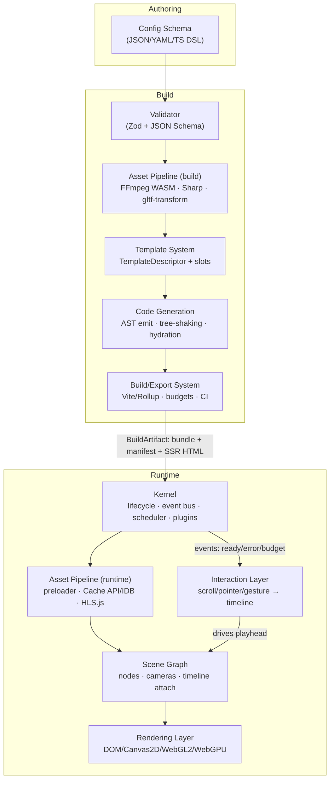

# Lumen Engine — Foundational Web Engine Architecture

**Codename:** *Lumen* — a single declarative core that compiles into multiple cinematic frontends.

**Version:** 1.0 (Draft) · **Audience:** Platform engineering, frontend architecture, tooling teams

---

## 1. Executive Overview

### Vision

Lumen is a foundational web engine that turns a single declarative description — scenes, assets, interactions, and template selection — into four distinct classes of production frontends:

1. **Scroll-driven video engines** — scrubbed, frame-accurate video playback bound to scroll position (e.g., product unveil pages).
2. **Single-page cinematic sites** — full-bleed animated landing pages with choreographed camera moves, typography, and media.
3. **3D product viewers** — interactive GLB/USDZ viewers with hotspots, variants, and turntable/scroll orbit.
4. **Storytelling / scrollytelling engines** — long-form narrative layouts where text, media, and data graphics advance through a shared timeline.

### Design Principles

- **Declarative scene description.** Everything the engine renders is derived from a serializable scene graph plus a timeline. No imperative "draw" code lives in userland; behavior is configuration.
- **Config-driven generation.** One `lumen.config.ts` (or JSON/YAML) drives validation, code generation, and bundling. The same config can emit a static site, a widget, or an npm package.
- **Progressive enhancement.** Content is meaningful without JavaScript (SSR/semantic HTML), functional without WebGL (poster images, native `<video>`), and cinematic when capabilities allow.
- **Performance budgets as contracts.** Each output type ships with hard budgets (JS ≤ 170 KB gz for cinematic SPA, first-frame ≤ 2.5 s on 4G/Moto G-class, 60 fps sustained, 16 ms frame budget with 8 ms engine soft cap). Budgets are enforced in CI, not documented in prose.
- **Accessibility by construction.** Reduced-motion fallbacks, keyboard/screen-reader equivalents for every scroll-driven state, focus management in scrollytelling, and WCAG 2.2 AA contrast tokens in the theming system are generated, not bolted on.
- **One kernel, many shells.** The four output types differ in template and interaction bindings, never in core runtime code. This keeps the maintenance surface small and quality uniform.

### Supported Output Types (Build Targets)

| Target | Form | Primary consumer |
|---|---|---|
| Static site | Pre-rendered HTML + hashed assets | Marketing pages, campaigns |
| Embeddable widget | Self-contained Web Component (`<lumen-player>`) | CMS embedding, third-party sites |
| npm library | ESM/CJS package with typed React/vanilla bindings | Product teams composing experiences |
| Standalone runtime | `lumen.min.js` + JSON config fetched at runtime | A/B testing, config-only iteration |

---

## 2. System Context & Data Flow

### Pipeline Overview

The engine is organized as three phases with strictly one-directional data flow:

**Authoring/Config → Build → Runtime**

- *Authoring:* Humans (or CMS tooling) write declarative config: scenes, assets, interactions, template choice.
- *Build:* The configuration is validated, assets are transcoded into a manifest, a template descriptor composes the scene graph, and the code generator emits a tree-shaken bundle plus pre-rendered HTML.
- *Runtime:* The Kernel boots, the asset pipeline streams media, the renderer and scene graph execute the timeline driven by the interaction layer.

### Module Interaction Diagram



### Data Flow Contract

1. Config is validated into a typed `EngineConfig`.
2. Asset pipeline produces an `AssetManifest` (content-hashed URLs, variants, byte sizes).
3. Template descriptor + config produce a serialized `SceneNode` tree and `TimelineTrack[]`.
4. Codegen emits a bundle containing only the modules the template exercises.
5. At runtime, the Kernel hydrates: manifest → preloader → scene graph → renderer; interaction events advance timeline time; the scheduler renders frames within budget.

---

## 3. Module Specifications

### 3.1 Kernel

**Responsibilities**
- Owns the engine lifecycle state machine: `created → booting → loading → ready → active → paused → disposed`.
- Provides a typed pub/sub event bus; all cross-module communication flows through it (no direct module-to-module imports at runtime).
- Maintains the plugin registry: plugins declare `provides`/`consumes` capabilities and lifecycle hooks; the Kernel resolves the dependency DAG and initializes them in topological order.
- Runs the cooperative frame scheduler: a single `requestAnimationFrame` loop with prioritized queues (input → timeline → scene update → render → post). Work is budgeted; overflow defers to `requestIdleCallback` or a Worker.
- Performs capability detection once, at boot: WebGL2/WebGPU support, codec support via `MediaCapabilities.decodingInfo()` (H.264/HEVC/AV1/VP9; audio AAC/Opus), `OffscreenCanvas`, `prefers-reduced-motion`, device memory/cores. Result is an immutable `CapabilityProfile` consumed by every other module.
- Implements error boundaries: each module runs in a guarded zone; failures are contained, reported via `engine:error`, and trigger the configured fallback (e.g., WebGL → Canvas2D → poster image).

**Inputs / Outputs**
- *Inputs:* `EngineConfig` (validated), `CapabilityProfile` probes, plugin modules.
- *Outputs:* `KernelHandle` (lifecycle control), event bus instance, `CapabilityProfile`, scheduler tick events.

**Data Structures**

```ts
export type LifecyclePhase =
  | 'created' | 'booting' | 'loading' | 'ready'
  | 'active' | 'paused' | 'disposed';

export interface CapabilityProfile {
  readonly webgl2: boolean;
  readonly webgpu: boolean;
  readonly offscreenCanvas: boolean;
  readonly codecs: Record<'h264' | 'hevc' | 'av1' | 'vp9', CodecSupport>;
  readonly maxTextureSize: number;
  readonly deviceMemoryGB: number | null;
  readonly reducedMotion: boolean;
  readonly dpr: { min: number; max: number; current: number };
}

export interface CodecSupport {
  supported: boolean;
  smooth: boolean;      // MediaCapabilities: smooth playback
  powerEfficient: boolean;
}

export interface EngineEventMap {
  'lifecycle:change': { from: LifecyclePhase; to: LifecyclePhase };
  'scheduler:budget-exceeded': { frameMs: number; phase: string };
  'engine:error': EngineError;
  'asset:progress': { loaded: number; total: number };
  'timeline:seek': { time: number; source: 'user' | 'programmatic' };
}

export interface LumenPlugin {
  readonly name: string;
  readonly version: string;
  readonly provides?: string[];      // capability tokens, e.g. 'renderer:webgpu'
  readonly consumes?: string[];
  init(ctx: KernelContext): void | Promise<void>;
  dispose(): void | Promise<void>;
}

export interface EngineError {
  module: string;
  code: string;
  recoverable: boolean;
  cause?: unknown;
}

export interface KernelHandle {
  readonly phase: LifecyclePhase;
  readonly capabilities: CapabilityProfile;
  start(): Promise<void>;
  pause(): void;
  resume(): void;
  dispose(): Promise<void>;
  on<K extends keyof EngineEventMap>(
    event: K,
    handler: (payload: EngineEventMap[K]) => void,
  ): () => void;
}

export interface KernelContext {
  readonly capabilities: CapabilityProfile;
  readonly events: KernelHandle['on'];
  reportError(err: EngineError): void;
}
```

**Tech Stack**
- **Custom event bus** (~1 KB) instead of RxJS/mitt: we need typed maps, once-listeners, and priority ordering; a purpose-built emitter is smaller and tree-shakeable.
- **Native `MediaCapabilities` API** for codec detection (async, spec-standard); with a static fallback table for older Safari.
- **`scheduler.postTask()`** where available (Chrome/Edge) for prioritized scheduling, polyfilled with a rAF + MessageChannel queue elsewhere. We deliberately avoid a full custom micro-scheduler framework — complexity outweighs gains.
- **No framework dependency.** The Kernel is vanilla TS so every template and every embedding host can adopt it.

---

### 3.2 Rendering Layer

**Responsibilities**
- Abstracts four render backends behind one `IRenderer` interface: DOM/CSS (transforms, composited layers), Canvas2D, WebGL2 (default for 3D and video compositing), WebGPU (opt-in, compute-heavy scenes).
- Implements renderer selection: consults `CapabilityProfile`, template hints, and scene requirements, then picks the highest-fidelity backend with a working fallback chain.
- Manages render targets: canvas pools, MSAA offscreen targets for post-processing, `ImageBitmap` handoff from the asset pipeline, and WebGPU swapchain configuration.
- Enforces frame budgeting: instruments per-phase render cost and reports overruns to the Kernel.
- Runs adaptive quality: dynamically scales render resolution (DPR scaling 0.5–2.0), MSAA level, and post-processing passes based on a rolling frame-time EMA, with hysteresis to avoid oscillation.

**Inputs / Outputs**
- *Inputs:* `RenderFrame` (resolved scene draw list from the scene graph), `CapabilityProfile`, quality directives.
- *Outputs:* Pixels to canvas; frame statistics to the Kernel; `RenderTarget` handles to the asset pipeline for texture upload.

**Data Structures**

```ts
export type RendererBackend = 'dom' | 'canvas2d' | 'webgl2' | 'webgpu';

export interface IRenderer {
  readonly backend: RendererBackend;
  init(surface: HTMLCanvasElement | OffscreenCanvas): Promise<void>;
  createTarget(desc: RenderTargetDesc): RenderTarget;
  uploadTexture(asset: TextureAsset): TextureHandle;
  render(frame: RenderFrame, stats: FrameStats): void;
  setQuality(q: QualityLevel): void;   // adaptive quality controller
  resize(width: number, height: number, dpr: number): void;
  dispose(): void;
}

export interface RenderFrame {
  time: number;
  camera: CameraState;
  drawList: DrawCall[];
  post: PostProcessPass[];            // e.g. bloom, grain, vignette
  clearColor: [number, number, number, number];
}

export interface QualityLevel {
  dprScale: number;        // 0.5..2.0
  msaa: 0 | 2 | 4 | 8;
  postPasses: string[];    // passes currently enabled
  shadowMapSize?: number;
}

export interface FrameStats {
  cpuMs: number;
  gpuMsEstimate: number;
  drawCalls: number;
  overBudget: boolean;
}
```

**Tech Stack**
- **Three.js (r160+) for WebGL2 and WebGPU** via `WebGPURenderer`. Rationale: mature scene utilities, maintained WebGPU backend, and TSL node materials give us one shader authoring path across both APIs. We wrap it behind `IRenderer` so the dependency is swappable and tree-shaken per template (DOM-only templates never import Three).
- **Raw WebGL2 only for the video-compositing path** (YUV→RGB shader, sub-1 KB): pulling in Three for a single fullscreen quad is unjustified bundle weight in the scroll-video template.
- **Adaptive quality:** custom controller using an exponential moving average of frame time with a 500 ms cooldown between steps. Libraries like `detect-gpu` inform the initial quality tier.
- **OffscreenCanvas + Worker rendering** is supported for the 3D viewer template when `OffscreenCanvas` is available, keeping the main thread free for scroll/input.

---

### 3.3 Scene Graph

**Responsibilities**
- Maintains the node hierarchy (`SceneNode`) with local/world transforms, visibility, and render-layer ordering.
- Supports hybrid scenes: spatial (3D) nodes and DOM nodes coexist; DOM nodes may be anchored to 3D positions (e.g., hotspot labels projected to screen space).
- Attaches timeline tracks to animatable properties (transform, opacity, material params, camera, video playhead).
- Performs dirty-flag updates: only nodes whose local state changed recompute world transforms; unchanged subtrees are skipped each frame.
- Serializes/deserializes: the build pipeline emits the scene graph as compact JSON; runtime rehydrates it without executing author code.

**Inputs / Outputs**
- *Inputs:* serialized `SceneNode` tree, `TimelineTrack[]`, camera descriptors, tick time from the scheduler.
- *Outputs:* `RenderFrame` (draw list + camera state) to the rendering layer; DOM mutation instructions for hybrid nodes.

**Data Structures**

```ts
export interface SceneNode {
  id: string;
  kind: 'group' | 'mesh' | 'video-plane' | 'dom' | 'camera' | 'light' | 'sprite';
  transform: Transform3D;             // local; world computed
  visible: boolean;
  layer: number;                      // render ordering
  bindings: PropertyBinding[];        // timeline attachments
  children: SceneNode[];
  payload?: MeshPayload | DomPayload | VideoPayload;
  meta?: Record<string, unknown>;     // template-specific, namespaced
}

export interface Transform3D {
  position: [number, number, number];
  rotationQuat: [number, number, number, number];
  scale: [number, number, number];
}

export interface PropertyBinding {
  trackId: string;                    // references TimelineTrack.id
  property: string;                   // e.g. 'transform.position.y', 'material.opacity'
  easing?: EasingName | CubicBezier;
}

export interface TimelineTrack {
  id: string;
  target: string;                     // SceneNode.id
  keyframes: Keyframe[];              // sparse, sorted
  driver: 'time' | 'scroll' | 'pointer' | 'playback';
  range: [number, number];            // seconds or scroll units
}

export interface Keyframe {
  t: number;
  value: number | number[] | string;
  easing?: EasingName;
}

export type EasingName =
  | 'linear' | 'ease-in' | 'ease-out' | 'ease-in-out' | 'step';

export type CubicBezier = [number, number, number, number]; // x1, y1, x2, y2
```

**Tech Stack**
- **Custom scene graph**, not Three's `Object3D` as the source of truth: we need DOM/3D hybrid nodes, serialization, and template-agnostic semantics. Three objects are *derived views* per renderer. This indirection is the single most important architectural decision in the engine — it is what lets one scene description power four output types.
- **Transform math:** `gl-matrix` (SIMD-friendly, tiny, battle-tested).
- **Dirty flags:** epoch counters per subtree; a node stores `localEpoch` and `worldEpoch`, and world recomputation walks only paths where `localEpoch > lastComputedEpoch`.
- **Serialization:** flat node array with parent indices (not nested JSON) for 30–50% smaller payloads and O(n) rehydration.

---

### 3.4 Asset Pipeline

**Responsibilities**
- *Build-time ingestion:* accepts images, video, GLTF/GLB, fonts, and Lottie JSON; validates, probes (dimensions, duration, color space), and fingerprints each asset.
- *Transcoding:* video → HLS (fMP4 segments, multi-bitrate ladder) plus a poster frame; images → AVIF/WebP with responsive `srcset` widths; models → Draco/meshopt compression with KTX2/BasisU textures; fonts → subset WOFF2.
- *Manifest generation:* emits a content-hashed `AssetManifest` mapping logical IDs to variant URLs, byte sizes, and preload priorities.
- *Runtime preloading:* priority queue (critical → eager → lazy) driven by the scene graph's entry view; integrates with the Kernel's loading phase and progress events.
- *Caching:* Cache API for segments and textures with LRU eviction in IndexedDB metadata; versioned cache keys bound to the content hash.
- *CDN layout:* stable, hash-addressed paths (`/assets/<hash>/<name>.<ext>`) enabling immutable caching headers.

**Inputs / Outputs**
- *Inputs (build):* raw asset files, transcode profiles from config.
- *Outputs (build):* transcoded asset tree, `AssetManifest` JSON.
- *Inputs (runtime):* `AssetManifest`, preload hints from the scene graph.
- *Outputs (runtime):* `ImageBitmap`/`VideoTexture`/`ArrayBuffer` handles, progress events.

**Data Structures**

```ts
export interface AssetManifest {
  version: 1;
  generatedAt: string;
  assets: Record<string, AssetEntry>;
}

export type AssetEntry =
  | ImageAssetEntry | VideoAssetEntry | ModelAssetEntry
  | FontAssetEntry | LottieAssetEntry;

export interface VideoAssetEntry {
  type: 'video';
  id: string;
  duration: number;
  poster: string;                     // hashed URL
  variants: {
    hls?: { playlist: string; bandwidths: number[] };
    mp4?: { url: string; bytes: number; codec: 'h264' | 'hevc' | 'av1' };
    webm?: { url: string; bytes: number };
  };
  preload: 'critical' | 'eager' | 'lazy';
  scrubOptimized: boolean;            // all-keyframe / low-GOP encode for scroll scrubbing
}

export interface ModelAssetEntry {
  type: 'model';
  id: string;
  url: string;                        // .glb, meshopt-compressed
  bytes: number;
  textures: 'ktx2' | 'webp-fallback';
  draco: boolean;
  bounds: { min: [number, number, number]; max: [number, number, number] };
  preload: 'critical' | 'eager' | 'lazy';
}
```

**Tech Stack**
- **FFmpeg compiled to WASM** for in-CI/local transcoding of the default ladders; production pipelines can swap in server-side FFmpeg behind the same profile interface. HLS output is **fMP4** (single codec family, works natively on Safari 17+ and via HLS.js elsewhere).
- **HLS.js** at runtime for non-Safari; native HLS on Safari. For scroll-scrub video specifically we prefer **low-GOP MP4 + `requestVideoFrameCallback` scrubbing** or, at the extreme, canvas blitting of a preloaded video element — HLS latency is unsuitable for frame-scrubbing; HLS is for linear playback segments.
- **`@gltf-transform/cli`** (Draco + meshopt + KTX2) for model optimization — the de-facto standard, scriptable in CI.
- **Sharp** for AVIF/WebP responsive image generation.
- Runtime cache: **Cache API + small IndexedDB LRU index** via `idb-keyval`; we avoid Workbox to keep bundle weight and behavior fully deterministic.

---

### 3.5 Interaction Layer

**Responsibilities**
- Normalizes all input — wheel, touch, pointer, keyboard, deviceorientation, and scroll — into a unified `InputEvent` stream with consistent coordinate spaces and timestamps.
- Provides gesture recognizers: pan, pinch, swipe, tap, long-press; recognizers are composable and conflict-resolved by priority.
- Implements scroll virtualization and smoothing: maps raw scroll into a smoothed, clamped virtual playhead (with lerp/inertia) so timeline scrubbing is frame-consistent across browsers and input devices.
- Binds interactions to the scene timeline: an `InteractionBinding` maps input domain (scroll range, drag delta) to timeline range, optionally with snap points.
- Ships accessibility fallbacks: when `prefers-reduced-motion` or assistive-tech mode is active, scroll-binding degrades to discrete, keyboard-navigable steps; every timeline state is reachable via buttons/keys.

**Inputs / Outputs**
- *Inputs:* DOM events (wheel/touch/pointer/keyboard), `CapabilityProfile`, binding declarations from config.
- *Outputs:* normalized timeline time/delta to the scene graph; semantic navigation events (`scene:next`, `scene:prev`) to the Kernel.

**Data Structures**

```ts
export type Vec2 = [number, number];

export type InputSource =
  | 'wheel' | 'touch' | 'pointer' | 'keyboard' | 'deviceorientation' | 'script';

export interface NormalizedInputEvent {
  source: InputSource;
  timestamp: number;
  delta: Vec2;                        // normalized to viewport units
  position: Vec2;
  velocity: Vec2;
  modifiers: { shift: boolean; ctrl: boolean; alt: boolean };
}

export interface InteractionBinding {
  id: string;
  source: InputSource | 'gesture';
  gesture?: 'pan' | 'pinch' | 'swipe' | 'tap' | 'longpress';
  targetTrack: string;                // TimelineTrack.id
  inputRange: [number, number];       // px, radians, or unit deltas
  outputRange: [number, number];      // timeline seconds
  smoothing: { type: 'lerp' | 'spring'; factor: number };
  snap?: number[];                    // snap points in outputRange
  a11yFallback: 'steps' | 'static' | 'native-video';
}

export interface VirtualScroller {
  attach(el: HTMLElement): void;
  readonly progress: number;          // 0..1 smoothed
  seek(p: number, opts?: { animate?: boolean }): void;
  setEnabled(on: boolean): void;
}
```

**Tech Stack**
- **Custom normalization layer** (~3 KB) rather than hammer.js: modern Pointer Events cover 95% of gestures; we only hand-roll pinch and inertia math. Hammer's mutation-heavy API doesn't fit our event-bus model.
- **Scroll smoothing: custom lerp-based virtual scroller**, not Lenis/GSAP ScrollSmoother, because we need deterministic mapping between scroll units and timeline seconds for scrub-accurate video — library smoothers optimize for feel, not frame determinism. (Lenis is supported as a plugin for templates that don't scrub video.)
- **`requestVideoFrameCallback`** (with timeupdate fallback) for binding video frames to the virtual scroll playhead.
- Keyboard/AT path: generated step-navigation uses roving `tabindex` and `aria-live="polite"` region announcements of scene titles.

---

### 3.6 Template System

**Responsibilities**
- Defines one `TemplateDescriptor` per frontend type: scroll-video, cinematic SPA, 3D viewer, storytelling.
- Declares slots/regions (hero, chapter, gallery, hotspot-layer…) and the composition rules that map config sections into scene graph subtrees.
- Owns theming tokens: color, type scale, spacing, motion curves — expressed as CSS custom properties and material uniforms simultaneously.
- Declares module requirements: which renderers, asset features, and interaction bindings the template needs (drives tree-shaking in codegen).
- Declares per-template performance budgets.

**Inputs / Outputs**
- *Inputs:* validated `EngineConfig`, `AssetManifest`.
- *Outputs:* serialized scene graph + timeline, hydration hints, theming token map, module requirement set for codegen.

**Data Structures**

```ts
export type TemplateKind = 'scroll-video' | 'cinematic-spa' | 'viewer-3d' | 'storytelling';

export interface TemplateDescriptor {
  kind: TemplateKind;
  version: string;
  slots: SlotDefinition[];
  tokens: ThemeTokens;
  requires: ModuleRequirement;        // tree-shaking contract
  budgets: PerformanceBudget;
  compose(cfg: EngineConfig, manifest: AssetManifest): ComposedScene;
}

export interface SlotDefinition {
  id: string;
  accepts: SceneNode['kind'][];       // what may be placed here
  min: number; max: number;           // cardinality
  region: 'dom' | 'spatial' | 'hybrid';
}

export interface ThemeTokens {
  colors: Record<string, string>;     // CSS var names
  typeScale: Record<string, { size: string; lineHeight: number; weight: number }>;
  spacing: Record<string, string>;
  motion: { standard: CubicBezier; emphasized: CubicBezier; duration: Record<string, number> };
}

export interface ModuleRequirement {
  renderers: RendererBackend[];       // e.g. ['webgl2'] or ['dom','canvas2d']
  assetFeatures: ('hls' | 'draco' | 'lottie' | 'ktx2')[];
  interactions: InputSource[];
}

export interface ComposedScene {
  sceneGraph: SceneNode[];
  tracks: TimelineTrack[];
  bindings: InteractionBinding[];
  hydration: { ssr: boolean; islands: string[] };
}
```

**Tech Stack**
- Templates are **plain TypeScript modules** (functions over config), not a string-templating language: full type-checking, unit-testable composition, and no parser to maintain.
- Theme tokens compile to **CSS custom properties** (DOM regions) and a **uniform block** (WebGL regions) from one source, guaranteeing visual parity between hybrid layers.
- Composition rules validated with the same **Zod schemas** as config (see 3.8), so a template can never emit an invalid scene graph.

---

### 3.7 Code Generation Layer

**Responsibilities**
- Transforms validated config + composed scene into executable, tree-shaken bundles: only modules listed in `ModuleRequirement` are imported.
- Emits TypeScript throughout, with template AST codegen (via `ts-morph`/TS compiler API) for the entry module, hydration manifest, and typed config accessors.
- Implements the hydration strategy: SSR/static HTML is pre-rendered at build; runtime hydrates *islands* (the canvas surface and interactive bindings) rather than the whole document.
- Emits per-target entry points (static site, Web Component wrapper, npm ESM entry, runtime loader).

**Inputs / Outputs**
- *Inputs:* `ComposedScene`, `TemplateDescriptor`, target descriptor.
- *Outputs:* `CodegenResult` — entry modules, hydration manifest, type declarations (`.d.ts`), SSR HTML fragments.

**Data Structures**

```ts
export interface CodegenTarget {
  target: 'static-site' | 'web-component' | 'npm-lib' | 'runtime-json';
  minify: boolean;
  ssr: boolean;
  moduleFormat: 'esm' | 'cjs' | 'iife';
}

export interface CodegenResult {
  entryModules: GeneratedModule[];    // path + TS source
  hydrationManifest: HydrationManifest;
  typeDeclarations: string;           // bundled .d.ts
  ssrHtml: string;                    // pre-rendered shell
  importGraph: string[];              // for bundle analysis
}

export interface GeneratedModule {
  path: string;                       // e.g. 'runtime/entry.scroll-video.ts'
  source: string;
  imports: string[];                  // module specifiers actually used
}

export interface HydrationManifest {
  islands: Array<{
    id: string;                       // DOM anchor id
    module: string;                   // chunk to load
    trigger: 'eager' | 'visible' | 'interaction';
    props: Record<string, unknown>;
  }>;
}
```

**Tech Stack**
- **TS compiler API via `ts-morph`** for AST-level codegen: precise, refactor-safe emission of typed entry modules; string templating (Handlebars/EJS) is explicitly rejected — it produces untypeable, drift-prone output.
- **Vite (Rollup under the hood)** as the bundling substrate, driven programmatically; per-target configs are generated, not hand-maintained.
- **Islands hydration** (Astro-style) with `visible`/`interaction` triggers via `IntersectionObserver` — the DOM shell is interactive immediately, the heavy canvas boots on approach.
- SSR: template-specific renderers produce static HTML for DOM regions and `` posters for spatial regions; there is intentionally no SSR of WebGL.

---

### 3.8 Configuration Schema

**Responsibilities**
- Defines the declarative DSL (JSON, YAML, or TS) describing scenes, assets, interactions, theming, and template selection.
- Enforces validation: Zod schemas are the single source of truth; JSON Schema is *generated* from Zod for external tooling and CMS validation.
- Handles versioning and migrations: every config carries `schemaVersion`; a migration registry upgrades older configs at load time, with deprecation warnings surfaced in build logs.

**Inputs / Outputs**
- *Inputs:* author-authored config files.
- *Outputs:* typed, validated `EngineConfig`; JSON Schema artifact for CMS/editors; migration reports.

**Data Structures**

```ts
export interface EngineConfig {
  schemaVersion: 3;
  id: string;
  template: TemplateKind;
  meta: { title: string; description: string; locale: string; ogImage?: string };
  theme: Partial<ThemeTokens>;
  assets: AssetRef[];
  scenes: SceneConfig[];
  interactions: InteractionConfig[];
  output: CodegenTarget;
}

export interface SceneConfig {
  id: string;
  slot: string;                       // references SlotDefinition.id
  nodes: SceneNodeConfig[];           // declarative subset of SceneNode
  track: { driver: TimelineTrack['driver']; durationOrRange: number };
  a11y: { label: string; summary?: string };
}

export interface AssetRef {
  id: string;
  src: string;                        // local path or URL
  kind: 'image' | 'video' | 'model' | 'font' | 'lottie';
  profile?: string;                   // transcode profile name
  preload?: 'critical' | 'eager' | 'lazy';
}

export interface Migration {
  from: number; to: number;
  migrate(cfg: Record<string, unknown>): Record<string, unknown>;
}
```

**Tech Stack**
- **Zod** for validation (best-in-class inference: the TS types above are *derived* from schemas, eliminating drift) + **`zod-to-json-schema`** to emit JSON Schema for CMS-side validation and editor autocompletion.
- **YAML support** via `yaml` parser feeding the same Zod pipeline; TS config via `vite-node`-style evaluation in the build only.
- Migrations: linear, versioned, pure functions — testable in isolation, applied at build with a hard error if a gap exists.

---

### 3.9 Build / Export System

**Responsibilities**
- Orchestrates the full compile: config validation → asset transcoding → template composition → codegen → bundling → artifact emission.
- Emits the four output targets from one invocation graph with maximal caching (content-addressed build cache; unchanged assets/config sections are never reprocessed).
- Performs code splitting: kernel chunk, renderer chunk(s), template chunk, per-island chunks; shared chunk deduplication across multi-scene sites.
- Applies asset hashing and immutable-URL rewriting; generates `manifest.json` for deploy tooling.
- Enforces size budgets in CI: bundlesize-style gates per target; build fails if JS gz size, critical asset bytes, or first-frame budget regress beyond threshold. Emits a budget report (PR comment JSON).

**Inputs / Outputs**
- *Inputs:* repo workspace (config, assets, templates, plugins), target list, CI environment.
- *Outputs:* `BuildArtifact[]` per target; budget report; deploy manifest.

**Data Structures**

```ts
export interface BuildArtifact {
  target: CodegenTarget['target'];
  outDir: string;
  entry: string;                      // html | js | json depending on target
  files: ArtifactFile[];
  budgets: BudgetReport;
  sourcemaps: boolean;
}

export interface ArtifactFile {
  path: string;
  hash: string;                       // content hash, also in filename
  bytes: number;
  gzipBytes: number;
  role: 'entry' | 'chunk' | 'asset' | 'ssr' | 'worker';
}

export interface BudgetReport {
  passed: boolean;
  checks: Array<{
    metric: 'js-gz' | 'css-gz' | 'critical-assets' | 'first-frame-ms' | 'lighthouse-a11y';
    budget: number;
    actual: number;
    deltaFromBaseline?: number;
  }>;
}
```

**Tech Stack**
- **Vite programmatic API + Rollup plugins** for bundling; esbuild for TS transpile, SWC not needed given Vite 5+ speed.
- **Content-addressed incremental cache** on disk (Turborepo-compatible remote cache optional): cache key = hash(config slice + asset bytes + template version + toolchain version).
- **Web Component target:** emitted with `customElements.define('lumen-player', …)`, Shadow DOM, and constructable stylesheets; the entire runtime self-registers from a single `<script src>`.
- **CI hooks:** GitHub Actions / GitLab CI templates shipped in-repo; budget failures block merge; a `--report=json` mode feeds dashboards.

---

## 4. Cross-Cutting Concerns

**Event flow contract.** All runtime cross-module communication uses the Kernel's typed bus. Modules never import each other at runtime; they declare capabilities (`provides`/`consumes`) in the plugin registry. Events are namespaced (`asset:`, `timeline:`, `lifecycle:`, `scheduler:`), payloads are immutable, and every event carries a monotonically increasing sequence number for debugging. Build-time modules may import shared types freely but never runtime state.

**Lifecycle phases.** Uniform contract across modules and plugins: `init` (allocate, no I/O blocking), `load` (fetch/decode, report progress), `activate` (join frame loop), `pause`, `dispose` (idempotent, releases GPU handles, aborts fetches). The Kernel guarantees dispose is called exactly once and tolerates partial initialization.

**Performance budgets.** Frame budget 16 ms (engine soft cap 8 ms, leaving headroom for browser work); input-to-paint latency ≤ 100 ms; JS ≤ 170 KB gz (cinematic SPA / storytelling), ≤ 220 KB gz (3D viewer incl. Three.js), ≤ 90 KB gz (scroll-video minimal template); critical assets ≤ 1.2 MB on first paint; Lighthouse a11y ≥ 95 enforced in CI. Adaptive quality must recover 55 fps within 1 s of a sustained drop.

**Error handling.** Recoverable errors (codec missing, WebGL context lost, asset 404) trigger the declared fallback chain and emit `engine:error` with `recoverable: true`. Non-recoverable errors (invalid config at runtime, plugin init throw) halt to a static SSR/poster state — never a blank page. WebGL context loss is handled explicitly: render targets are rebuilt from the asset manifest without re-fetching network resources where cache permits.

**Analytics hooks.** A single opt-in `analytics` plugin receives throttled lifecycle/timeline/interaction events (`scene:enter`, `timeline:milestone`, `scheduler:budget-exceeded`) with a user-supplied transport. No analytics code ships in core bundles; the plugin is tree-shaken unless configured.

**SSR/SEO.** DOM regions and scene metadata are pre-rendered; spatial/video regions render as poster `` with structured data (`VideoObject`, `Product` for 3D viewers). Canonical URLs, hreflang, and OpenGraph tags derive from `EngineConfig.meta`. SSR output is valid HTML without JS; hydration is strictly additive.

**Accessibility.** Every scroll/timeline interaction has a keyboard-operable step equivalent; `prefers-reduced-motion` swaps scrubbed timelines for crossfade steps; all text content lives in the DOM (never canvas-only); hotspot labels are real buttons; contrast tokens are validated at build; focus order follows scene order. These behaviors are generated by the template system, so they cannot be forgotten per-project.

---

## 5. Frontend-Type Mapping

| Module | Scroll-video | Cinematic SPA | 3D Viewer | Storytelling |
|---|---|---|---|---|
| Kernel | ●● | ●● | ●● | ●● |
| Rendering layer | ○ (Canvas2D/raw WebGL quad) | ● (DOM+WebGL) | ●● (WebGL2/WebGPU, OffscreenCanvas) | ○ (mostly DOM) |
| Scene graph | ● (shallow, video-plane centric) | ●● (hybrid DOM+spatial) | ●● (full 3D) | ● (DOM-centric) |
| Asset pipeline | ●● (scrub-optimized MP4, RVFC, posters) | ●● (HLS, responsive images, fonts) | ●● (Draco/meshopt, KTX2) | ● (images, Lottie, light video) |
| Interaction layer | ●● (scroll virtualization ↔ video playhead) | ● (scroll + pointer) | ●● (orbit/pinch gestures) | ●● (scroll steps, keyboard/AT navigation) |
| Template system | scroll-video descriptor | cinematic-spa descriptor | viewer-3d descriptor | storytelling descriptor |
| Codegen | minimal islands bundle | SSR + islands | worker + WebGPU flags | SSR-heavy, smallest runtime |
| Config schema | track driver `playback`/`scroll` | full hybrid nodes | camera/hotspot schema | chapter/step schema |
| Build/export | static site or embed widget | static site | npm lib / web component | static site |

Legend: ●● = heavily exercised / defining dependency, ● = moderate, ○ = minimal.

Key readings: scroll-video's critical path is *asset pipeline (scrub encodes) + interaction (scroll→playhead)*; the 3D viewer's is *WebGL/WebGPU renderer + scene graph*; storytelling leans on *SSR + accessibility fallbacks*; the cinematic SPA exercises everything moderately and is the reference integration target.

---

## 6. Evolution & Extensibility

**Plugin API.** Third parties extend Lumen through `LumenPlugin` with capability tokens. Example surfaces: custom gesture recognizers (`provides: ['gesture:air-swipe']`), analytics transports, CMS-backed config sources, custom transcode profiles. Plugins are versioned against a semver Kernel API; the registry detects capability conflicts at init and fails loudly with a resolution hint.

**Custom renderers.** Any object satisfying `IRenderer` can register as a backend (e.g., a SVG renderer for print exports, a Canvas2D fallback for kiosks, a future WebGPU-native renderer bypassing Three). The scene graph's renderer-agnostic draw list makes this a drop-in exercise: implement `render(frame)`, reuse texture/asset handles through the pipeline's upload interface.

**Custom templates.** A template is a typed module implementing `TemplateDescriptor`. Teams can ship private templates as npm packages; the build system discovers them via `template: 'pkg:acme/launch-template@^2'`. The Zod-validated composition contract guarantees custom templates cannot emit structurally invalid scenes, keeping quality uniform across first- and third-party output types.

**WebGPU migration path.** Phase 1 (current): WebGPU available behind the Three.js `WebGPURenderer`, opt-in per template, with automatic WebGL2 fallback — scene graph and timelines are untouched. Phase 2: TSL node materials replace hand-written GLSL so shaders compile to both WGSL and GLSL from one source. Phase 3: GPU compute (particle systems, video post-processing) moves to WebGPU compute shaders where `CapabilityProfile.webgpu` is true, gated by per-scene flags. Because capability detection, renderer abstraction, and quality scaling are already centralized in the Kernel and rendering layer, the migration touches no authoring surface — existing configs gain WebGPU acceleration transparently.

**Longer-horizon hooks.** The serialized scene graph and manifest formats are versioned independently of code, enabling future server-side scene composition, edge-rendered SSR islands, and WASM-accelerated timeline evaluation (the timeline evaluator's pure-function design is deliberately WASM-portable) without breaking existing projects.

---

*Document ends. Architecture questions and RFCs should be raised against the Kernel event contract first — it is the stability boundary for everything else.*
